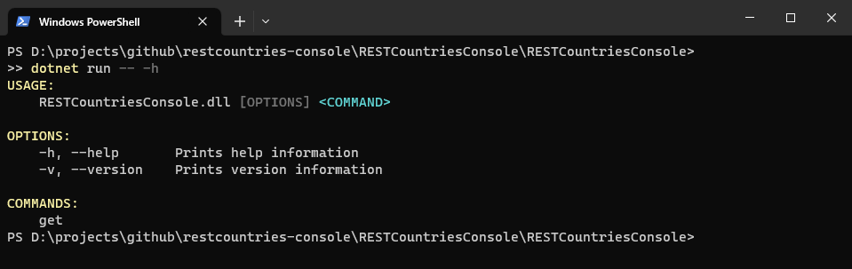
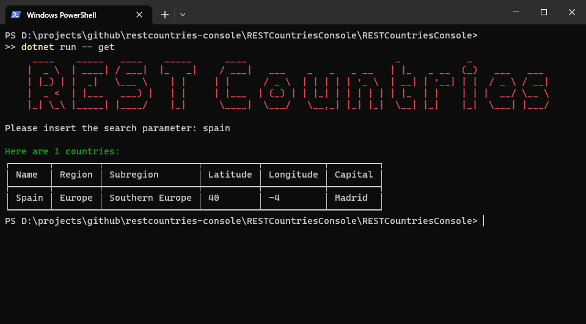

# RESTCountries Console

Simple console application to get information about countries using RESTCountries.com by using the [RESTCountriesSharp NuGet package](https://www.nuget.org/packages/RESTCountriesSharp) and [Spectre.Console.Cli NuGet package](https://www.nuget.org/packages/Spectre.Console.Cli/).

## Demo

`dotnet run -- -h`

`dotnet run -- get -h`

`dotnet run -- get`

`dotnet run -- get fullname -p France`

## Buy Me A Coffee

I appreciate any form of support to keep my _Open Source_ activities going.

Whatever you decide, be it reading and sharing my blog posts, using my NuGet packages or buying me a coffee/book, thank you ❤️.

## Contributing

Pull requests are welcome. For major changes, please open an issue first
to discuss what you would like to change.

Please make sure to update tests as appropriate.

## License

[MIT](https://choosealicense.com/licenses/mit/)